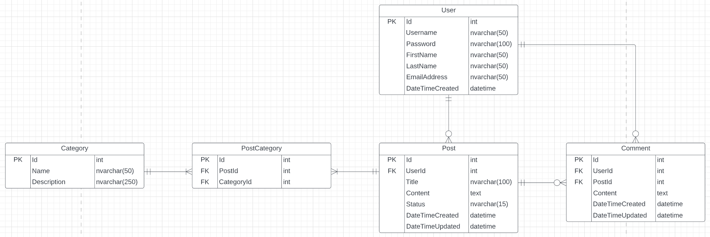

# Amblog (Blog API)
## ⚠️ TASK
1. Complete the `UserControllerTests`.
2. Create and complete unit tests for `ICommentService`.

## References
 - https://code-maze.com/unit-testing-aspnetcore-web-api/
 - https://code-maze.com/unit-testing-controllers-aspnetcore-moq/
 - https://learn.microsoft.com/en-us/dotnet/core/testing/unit-testing-best-practices
 
## This API operates on five types of entities:

* **User**: This represents a blog user. This is used to identify the creator of the post or comment.
* **Post**: This represents a post created by a user. Each post is always assigned to a specific user.
* **Comment**: This represents a comment on a post. Each comment is always assigned to a specific post.
* **Category**: This represents a specific category. This is used to group posts according to certain topics.
* **PostCategory**: This represents the connection between posts and categories.

---
### Base Code by:
**Jaimes Edward Cabante** \
**Jonas Angelo Clamor** \
**Xavier David Maranga** \
**John William Miones**

### Prepared by:
**Jhon Christian Ambrad**
